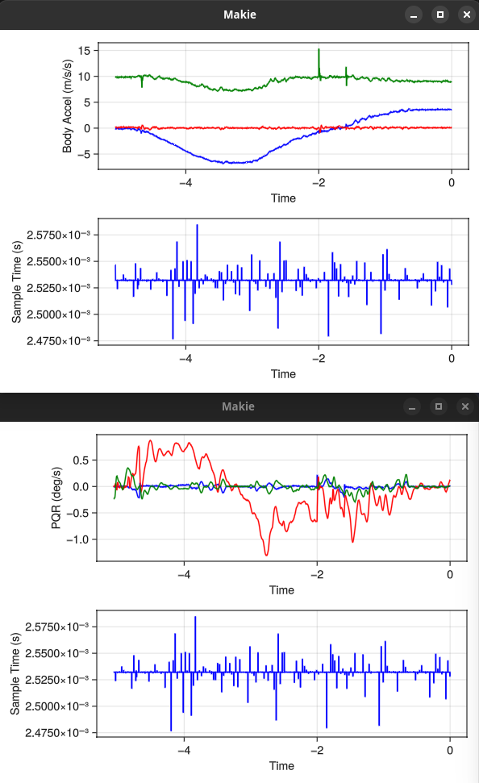

# SensorClient

Connect to [SensorServer](https://github.com/umer0586/SensorServer) using websocket, read and plot sensor data in real-time.

## Dependencies

The following are needed to run the demo script, `main.jl`.

- [SensorServer](https://github.com/umer0586/SensorServer) on a supported Android device.
- `just >=1.38.0` [optional]
- `julia >= 1.11.3`

## Run demo script with just

Using `just` receipt to run demo script.

1. Confirm that all the dependencies are installed including optional.
2. Define required environment variables, see [.env.example](./.env.example).
3. Install julia packages: `just init`.
4. Run demo script: `just run`

By default, four figures will show up

